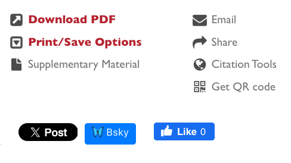

# Bluesky button for bioRxiv

Chrome extension to add a button to bioRxiv preprints to post to Bluesky.

## Installation

Download a zip file of this repository and extract it somewhere on your computer (you can't move it once it's installed). Then, in Chrome, go to `chrome://extensions/` in your address bar and enable Developer mode in the top right. Click "Load unpacked" and select the folder where you extracted the zip file.